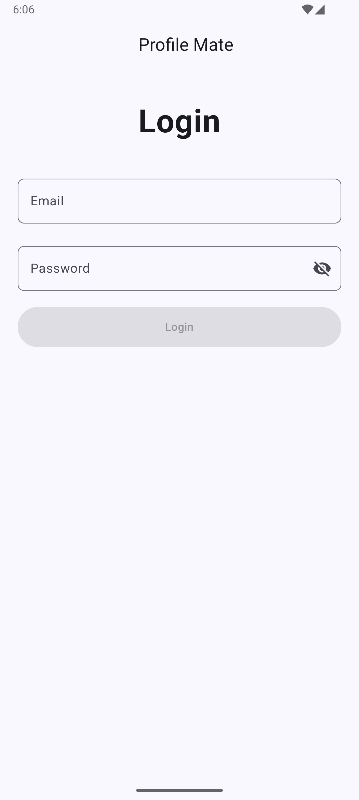
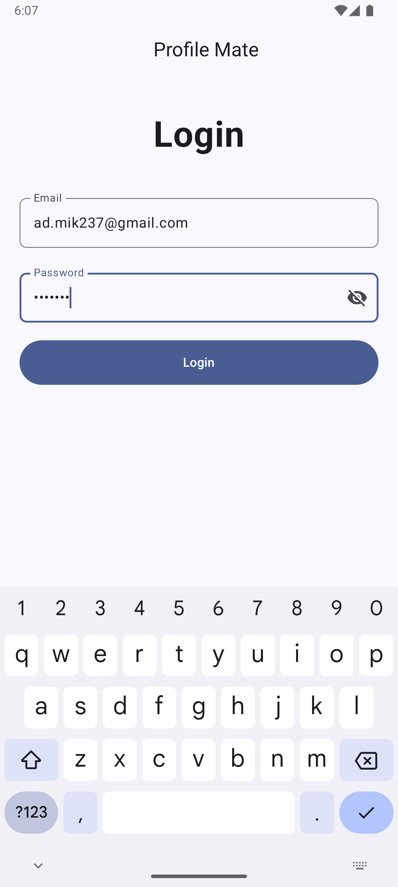
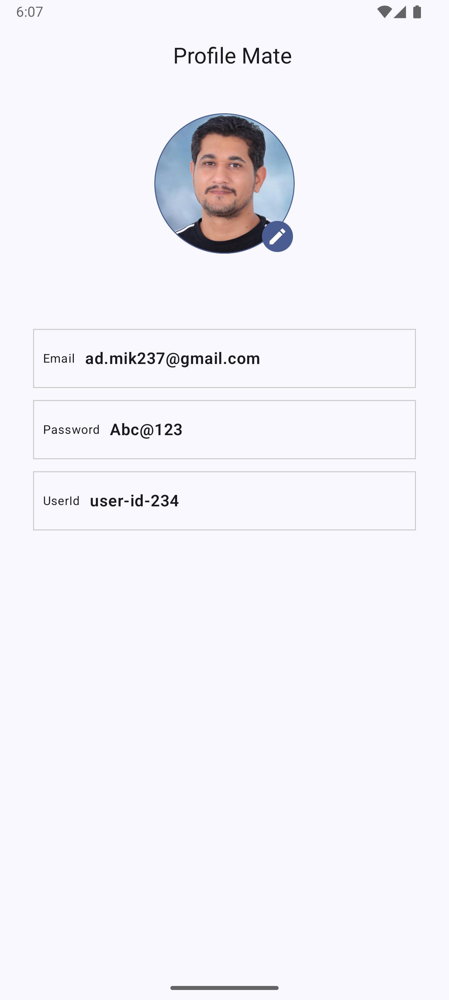
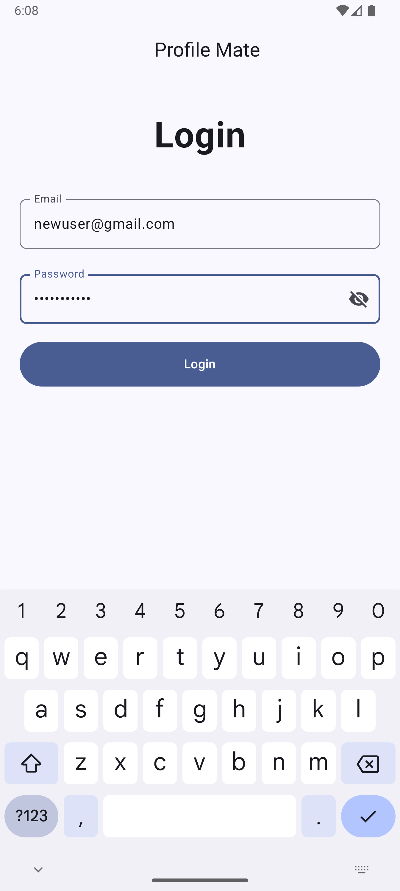
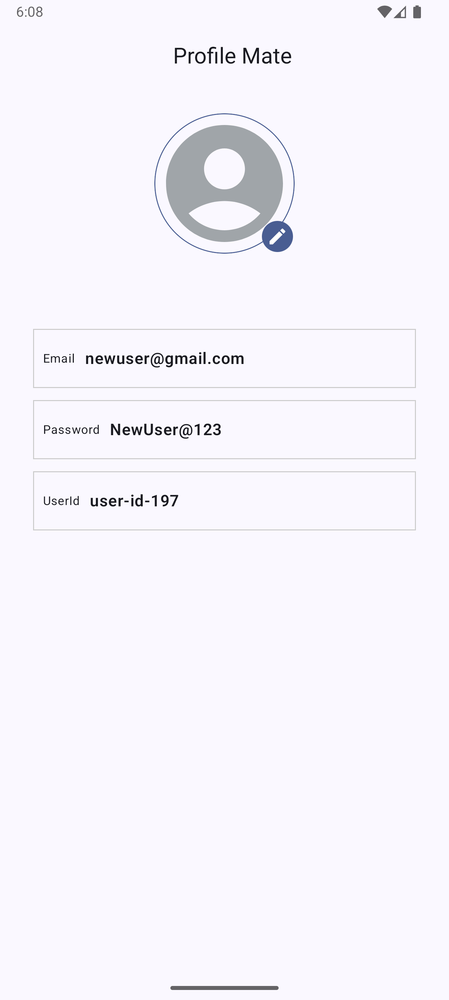

# ProfileMate

## Overview
ProfileMate is a Kotlin Android app built to demonstrate the implementation of a user login system, fetching user profile data from a back-end, and allowing users to update their profile avatars using their camera or gallery. The app is designed with modern Android development practices, utilizing Jetpack Compose, Clean Architecture, and various other technologies to create a modular and scalable application.

## Features
- User Login: A simple login screen where users can input their email and password. Successful login returns a token and user ID.
- Automatic Login: Users remain logged in across sessions by storing the API token securely.
- User Profile: Displays user profile data including email, password, and avatar.
- - Email and password are read-only.
- - Avatar can be edited by selecting an image from the gallery or taking a new one using the camera.
- Image Handling: The avatar is displayed as a circular image, with a default blank silhouette if no avatar is set.
- Gravatar Support: If a user has a Gravatar associated with their email and they have not uploaded a specific avatar, the app displays their Gravatar image.

Screenshots
-----------
  


## Tech Stack
- **Kotlin**: Programming language used for Android development.
- **Jetpack Compose**: Modern toolkit for building native UI.
- **Clean Architecture**: Organizes code into layers to separate concerns.
- **Retrofit**: HTTP client for making API requests.
- **Hilt**: Dependency Injection library.
- **Coroutines**: For asynchronous programming.
- **Flow**: For handling data streams.
- **ViewModel**: Lifecycle-aware components for managing UI-related data.
- **Coil**: Image loading library for Android.

## Prerequisites
1. **Android Studio Arctic Fox or later**: Ensure you have the latest version of Android Studio installed.
2. **Gravatar Account**: If you want to upload and use a Gravatar image, ensure you have an account on [Gravatar](https://gravatar.com).

## Getting Started
1. **Clone the repository**:
   ```bash
   git clone https://github.com/mik237/ProfileMate.git

2. **Open the project in Android Studio**:
    - Open Android Studio.
    - Select `Open an existing project`.
    - Navigate to the cloned repository and open it.

3. **Build and Run the app**:

## Libraries Used
- [Jetpack Compose](https://developer.android.com/jetpack/compose): Modern UI toolkit.
- [Retrofit](https://square.github.io/retrofit/): Type-safe HTTP client.
- [Hilt](https://dagger.dev/hilt/): Dependency Injection.
- [Coroutines](https://kotlinlang.org/docs/coroutines-overview.html): Asynchronous programming.
- [Flow](https://developer.android.com/kotlin/flow): Handling data streams.
- [Coil](https://coil-kt.github.io/coil/): Image loading.
- [MockWebServer](https://github.com/square/okhttp/tree/master/mockwebserver): HTTP mock server for testing.
